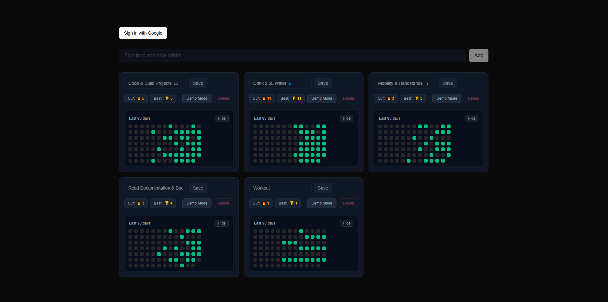
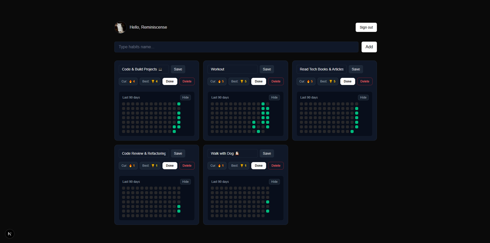
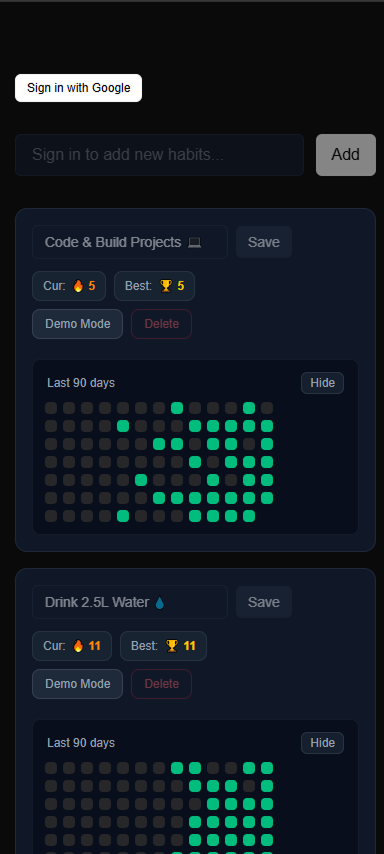

# 📝 Habit Tracker

A full-stack, production-ready habit tracking application built with Next.js 16 App Router, Prisma v7, Neon PostgreSQL, and Auth.js v5.

## 🚀 Live Demo
[View Live Demo](https://habit-tracker-delta-sand.vercel.app/)

## 📸 Screenshots

### Demo Mode View


### Authenticated View


### Mobile View


## ✨ Features
- **Instant Demo Mode:** Architectural fallback that allows guests to test full interactive functionality with isolated mock data without requiring sign-in.
- **Secure Google OAuth 2.0:** Seamless user authentication powered by Auth.js v5 with isolated persistent data per user.
- **Habit Management & Logging:** Create, track, and log daily habit completions with real-time state updates.
- **Responsive Layout:** Optimized interface for mobile and desktop screens built with Tailwind CSS.
- **Production-Graded Reliability:** Complete error boundary protection on Server Actions to ensure smooth UX.

## 🛠️ Tech Stack
- **Framework:** Next.js 16 (App Router, Server Components & Server Actions)
- **Language:** TypeScript
- **Database & ORM:** PostgreSQL (Neon Serverless), Prisma v7
- **Authentication:** Auth.js v5 (Google OAuth)
- **Styling:** Tailwind CSS
- **Deployment:** Vercel

## 🧠 Technical Highlights

- **Dual-State Architecture (Demo vs. Auth):** Built a zero-friction demo mode. Unauthenticated visitors use client-side mock habits, avoiding unnecessary database hits. Authenticated users seamlessly query PostgreSQL with strict session filters (`session.user.id`).
- **Resilient Server Actions:** Wrapped database mutations and server actions in robust error boundaries with try-catch logic, preventing application crashes and providing clean user feedback.
- **Optimized Data Aggregation:** Applied O(1) Hash Map lookups for fast client-side habit history calculation and date comparisons, ensuring fluid UI performance.

## ⚙️ Running Locally

To run this project on your local machine, follow these steps:

1. Clone the repository:

   ```bash
   git clone https://github.com/reminiscensee/habit-tracker.git
   ```
2. Navigate to the project folder:

   ```bash
   cd habit-tracker
   ```
3. Install dependencies:

   ```bash
   pnpm install
   ```
4. Set up environment variables in a .env file:

   ```bash
   DATABASE_URL="your-neon-postgres-url"
   AUTH_SECRET="your-auth-secret"
   GOOGLE_CLIENT_ID="your-google-client-id"
   GOOGLE_CLIENT_SECRET="your-google-client-secret"
   ```
5. Push Prisma schema and generate client:

   ```bash
   npx prisma db push
   npx prisma generate
   ```
6. Start the development server:

   ```bash
   pnpm dev
   ```
